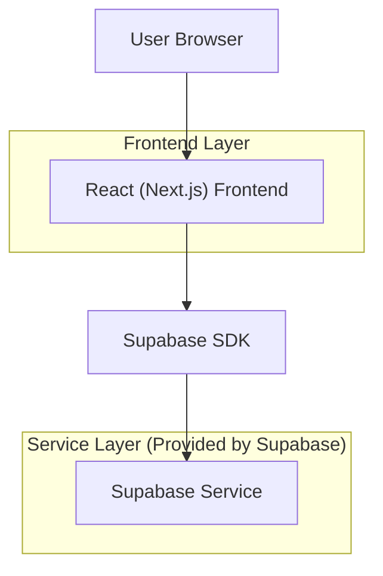
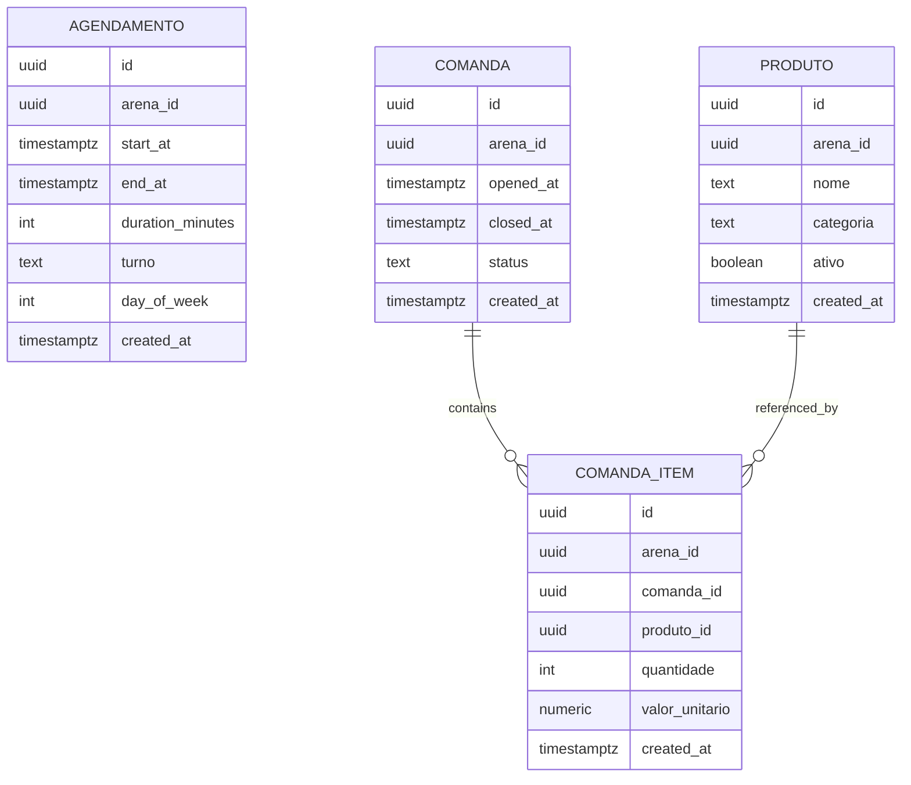

## 1.Architecture design



## 2.Technology Description
- Frontend: React@18 + Next.js (App Router) + TypeScript
- Backend: Supabase (Auth + Postgres)

## 3.Route definitions
| Route | Purpose |
|-------|---------|
| /arena/dashboard-operacional | Dashboard com métricas de agendamentos e comandas, com filtros por período |

## 6.Data model(if applicable)

### 6.1 Data model definition


### 6.2 Data Definition Language
Agendamentos (agendamentos)
```sql
CREATE TABLE agendamentos (
  id UUID PRIMARY KEY DEFAULT gen_random_uuid(),
  arena_id UUID NOT NULL,
  start_at TIMESTAMPTZ NOT NULL,
  end_at TIMESTAMPTZ NOT NULL,
  duration_minutes INT NOT NULL,
  turno TEXT NOT NULL,
  day_of_week INT NOT NULL,
  created_at TIMESTAMPTZ DEFAULT NOW()
);

CREATE INDEX idx_agendamentos_arena_periodo ON agendamentos (arena_id, start_at);
CREATE INDEX idx_agendamentos_turno_dow ON agendamentos (arena_id, turno, day_of_week);

GRANT SELECT ON agendamentos TO anon;
GRANT ALL PRIVILEGES ON agendamentos TO authenticated;
```

Produtos (produtos)
```sql
CREATE TABLE produtos (
  id UUID PRIMARY KEY DEFAULT gen_random_uuid(),
  arena_id UUID NOT NULL,
  nome TEXT NOT NULL,
  categoria TEXT,
  ativo BOOLEAN DEFAULT TRUE,
  created_at TIMESTAMPTZ DEFAULT NOW()
);

CREATE INDEX idx_produtos_arena_nome ON produtos (arena_id, nome);

GRANT SELECT ON produtos TO anon;
GRANT ALL PRIVILEGES ON produtos TO authenticated;
```

Comandas (comandas) e itens (comanda_itens)
```sql
CREATE TABLE comandas (
  id UUID PRIMARY KEY DEFAULT gen_random_uuid(),
  arena_id UUID NOT NULL,
  opened_at TIMESTAMPTZ NOT NULL,
  closed_at TIMESTAMPTZ,
  status TEXT NOT NULL,
  created_at TIMESTAMPTZ DEFAULT NOW()
);

CREATE INDEX idx_comandas_arena_periodo ON comandas (arena_id, opened_at);

GRANT SELECT ON comandas TO anon;
GRANT ALL PRIVILEGES ON comandas TO authenticated;

CREATE TABLE comanda_itens (
  id UUID PRIMARY KEY DEFAULT gen_random_uuid(),
  arena_id UUID NOT NULL,
  comanda_id UUID NOT NULL,
  produto_id UUID NOT NULL,
  quantidade INT NOT NULL,
  valor_unitario NUMERIC(12,2) NOT NULL,
  created_at TIMESTAMPTZ DEFAULT NOW()
);

CREATE INDEX idx_comanda_itens_arena_comanda ON comanda_itens (arena_id, comanda_id);
CREATE INDEX idx_comanda_itens_produto ON comanda_itens (arena_id, produto_id);
