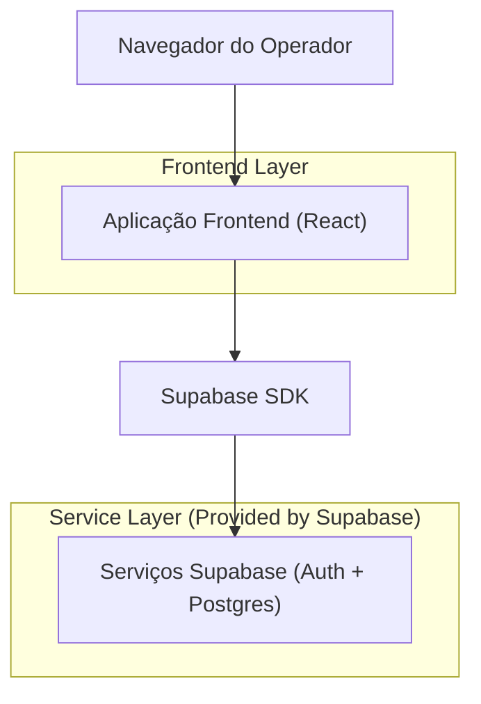
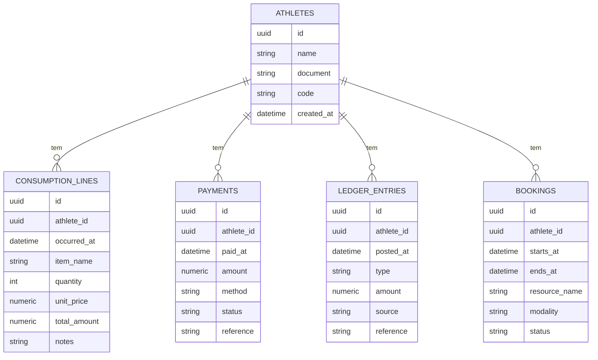

## 1.Architecture design


## 2.Technology Description
- Frontend: React@18 + TypeScript + vite + tailwindcss@3
- Backend: Supabase (Auth + PostgreSQL)

## 3.Route definitions
| Route | Purpose |
|-------|---------|
| /arena/historico-atleta | Tela para buscar atleta, filtrar período e visualizar consumo/pagamentos/conta corrente/agendamentos |

## 6.Data model(if applicable)

### 6.1 Data model definition


### 6.2 Data Definition Language
Athletes (athletes)
```
CREATE TABLE athletes (
  id UUID PRIMARY KEY DEFAULT gen_random_uuid(),
  name TEXT NOT NULL,
  document TEXT,
  code TEXT,
  created_at TIMESTAMPTZ NOT NULL DEFAULT NOW()
);

CREATE INDEX idx_athletes_name ON athletes (name);
CREATE INDEX idx_athletes_document ON athletes (document);
CREATE INDEX idx_athletes_code ON athletes (code);

GRANT SELECT ON athletes TO anon;
GRANT ALL PRIVILEGES ON athletes TO authenticated;
```

Consumo (consumption_lines)
```
CREATE TABLE consumption_lines (
  id UUID PRIMARY KEY DEFAULT gen_random_uuid(),
  athlete_id UUID NOT NULL,
  occurred_at TIMESTAMPTZ NOT NULL,
  item_name TEXT NOT NULL,
  quantity INT NOT NULL DEFAULT 1,
  unit_price NUMERIC(12,2) NOT NULL DEFAULT 0,
  total_amount NUMERIC(12,2) NOT NULL DEFAULT 0,
  notes TEXT
);

CREATE INDEX idx_consumption_lines_athlete_id_occurred_at ON consumption_lines (athlete_id, occurred_at DESC);

GRANT SELECT ON consumption_lines TO anon;
GRANT ALL PRIVILEGES ON consumption_lines TO authenticated;
```

Pagamentos (payments)
```
CREATE TABLE payments (
  id UUID PRIMARY KEY DEFAULT gen_random_uuid(),
  athlete_id UUID NOT NULL,
  paid_at TIMESTAMPTZ NOT NULL,
  amount NUMERIC(12,2) NOT NULL,
  method TEXT,
  status TEXT,
  reference TEXT
);

CREATE INDEX idx_payments_athlete_id_paid_at ON payments (athlete_id, paid_at DESC);

GRANT SELECT ON payments TO anon;
GRANT ALL PRIVILEGES ON payments TO authenticated;
```

Conta corrente (ledger_entries)
```
CREATE TABLE ledger_entries (
  id UUID PRIMARY KEY DEFAULT gen_random_uuid(),
  athlete_id UUID NOT NULL,
  posted_at TIMESTAMPTZ NOT NULL,
  type TEXT NOT NULL,
  amount NUMERIC(12,2) NOT NULL,
  source TEXT,
  reference TEXT
);

CREATE INDEX idx_ledger_entries_athlete_id_posted_at ON ledger_entries (athlete_id, posted_at DESC);

GRANT SELECT ON ledger_entries TO anon;
GRANT ALL PRIVILEGES ON ledger_entries TO authenticated;
```

Agendamentos (bookings)
```
CREATE TABLE bookings (
  id UUID PRIMARY KEY DEFAULT gen_random_uuid(),
  athlete_id UUID NOT NULL,
  starts_at TIMESTAMPTZ NOT NULL,
  ends_at TIMESTAMPTZ,
  resource_name TEXT,
  modality TEXT,
  status TEXT
);

CREATE INDEX idx_bookings_athlete_id_starts_at ON bookings (athlete_id, starts_at DESC);

GRANT SELECT ON bookings TO anon;
GRANT ALL PRIVILEGES ON bookings TO authenticated;
```