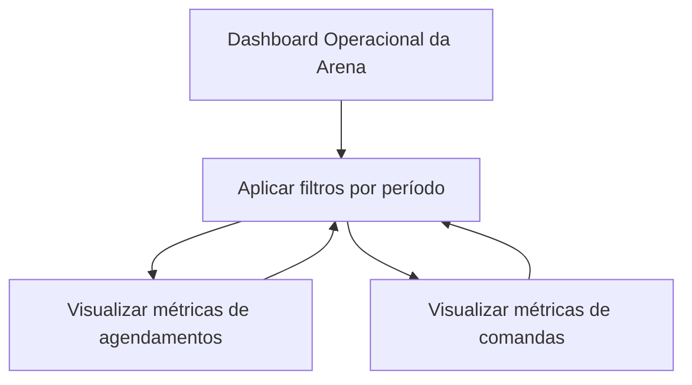

## 1. Product Overview
Dashboard operacional para a arena acompanhar desempenho de agendamentos e consumo em comandas.
Ajuda gestores a identificar padrões (turnos/dias) e itens mais vendidos com filtros por período.

## 2. Core Features

### 2.1 User Roles
| Papel | Método de cadastro | Permissões principais |
|------|---------------------|-----------------------|
| Operador/Gestor da Arena | Já existente no sistema (usuário vinculado à arena) | Visualizar métricas agregadas e rankings do período selecionado |

### 2.2 Feature Module
Nosso dashboard operacional consiste nas seguintes páginas principais:
1. **Dashboard Operacional da Arena**: filtros por período, métricas de agendamentos (duração mais consumida, gráfico por turno e dia da semana) e métricas de comandas (produtos mais consumidos).

### 2.3 Page Details
| Page Name | Module Name | Feature description |
|-----------|-------------|---------------------|
| Dashboard Operacional da Arena | Filtros de período | Selecionar período (data inicial e final) e aplicar/limpar filtros para recalcular todas as métricas exibidas. |
| Dashboard Operacional da Arena | Resumo de agendamentos | Exibir KPIs do período com base nos agendamentos filtrados (ex.: total de agendamentos, horas totais agendadas). |
| Dashboard Operacional da Arena | Duração mais consumida | Calcular e listar as durações (em minutos) mais frequentes/consumidas no período (ranking e/ou distribuição). |
| Dashboard Operacional da Arena | Gráfico por turno e dia da semana | Exibir gráfico agregando agendamentos por turno (ex.: manhã/tarde/noite) e por dia da semana, respeitando o período selecionado. |
| Dashboard Operacional da Arena | Produtos mais consumidos (comandas) | Exibir ranking de produtos mais consumidos no período (por quantidade), a partir dos itens de comandas do período filtrado. |
| Dashboard Operacional da Arena | Estados de carregamento e vazio | Indicar carregamento ao aplicar filtros e exibir estado vazio quando não houver dados no período. |

## 3. Core Process
**Fluxo do Operador/Gestor da Arena**
1. Acessa o Dashboard Operacional.
2. Define o período (data inicial e final) e aplica o filtro.
3. Analisa KPIs e rankings (durações e produtos).
4. Observa o gráfico por turno e dia da semana para identificar padrões.
5. Ajusta o período e repete a análise.

