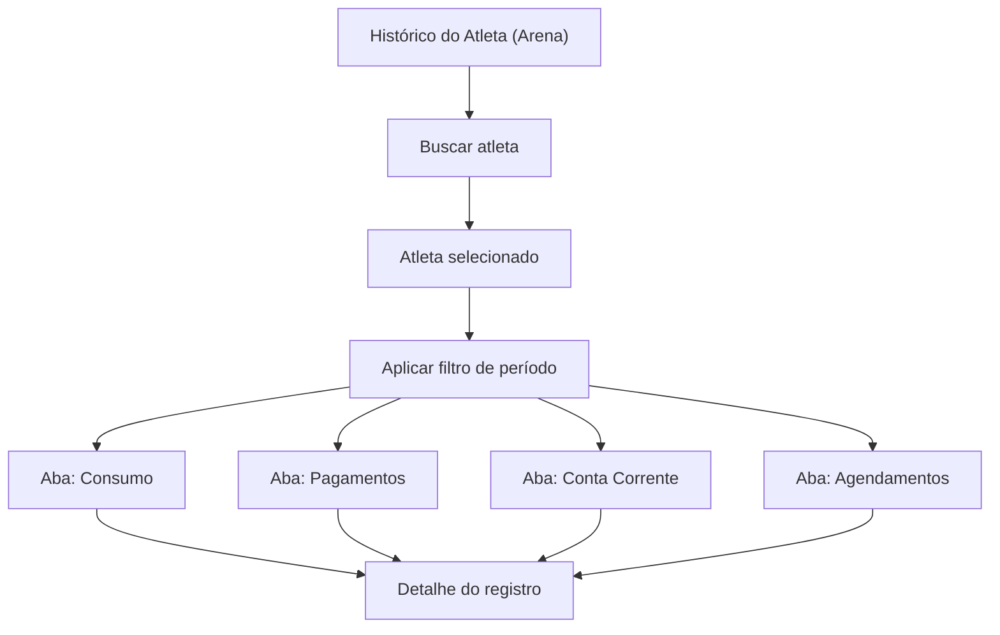

## 1. Product Overview
Tela de histórico do atleta para uso na arena, reunindo consumo, pagamentos, conta corrente e agendamentos.
Permite buscar atleta e filtrar por período para auditoria e atendimento rápido.

## 2. Core Features

### 2.1 User Roles
| Role | Registration Method | Core Permissions |
|------|---------------------|------------------|
| Operador da Arena | Acesso interno (pré-existente) | Buscar atleta, filtrar período e visualizar histórico: consumo, pagamentos, conta corrente e agendamentos |

### 2.2 Feature Module
Nossa necessidade consiste nas seguintes páginas:
1. **Histórico do Atleta (Arena)**: busca por atleta, filtros por período, abas de consumo/pagamentos/conta corrente/agendamentos, visualização de detalhes.

### 2.3 Page Details
| Page Name | Module Name | Feature description |
|-----------|-------------|---------------------|
| Histórico do Atleta (Arena) | Busca por atleta | Buscar por nome/documento/código e selecionar atleta para carregar o histórico. |
| Histórico do Atleta (Arena) | Filtros por período | Filtrar dados por intervalo (ex.: data inicial/final) e aplicar/limpar filtros. |
| Histórico do Atleta (Arena) | Abas de histórico | Alternar entre visões: Consumo, Pagamentos, Conta Corrente e Agendamentos mantendo filtros ativos. |
| Histórico do Atleta (Arena) | Lista de Consumo | Listar itens consumidos no período (data/hora, item, quantidade, valor, observação quando existir). |
| Histórico do Atleta (Arena) | Lista de Pagamentos | Listar pagamentos no período (data/hora, método, valor, status e referência). |
| Histórico do Atleta (Arena) | Conta Corrente | Exibir lançamentos (crédito/débito), saldo (quando disponível) e origem do lançamento. |
| Histórico do Atleta (Arena) | Agendamentos | Listar agendamentos no período (data/hora, modalidade/quadra, status e responsável). |
| Histórico do Atleta (Arena) | Detalhe do registro | Abrir detalhamento de um item selecionado (exibir campos completos do registro). |
| Histórico do Atleta (Arena) | Estados e validações | Exibir loading/empty/error, validar período (início <= fim) e indicar atleta selecionado. |

## 3. Core Process
**Fluxo do Operador da Arena**
1. Acessa a tela de Histórico do Atleta.
2. Usa a busca para localizar e selecionar um atleta.
3. Define um período e aplica o filtro.
4. Navega entre as abas (Consumo, Pagamentos, Conta Corrente, Agendamentos) para revisar o histórico no período.
5. Clica em um registro para abrir seus detalhes.

